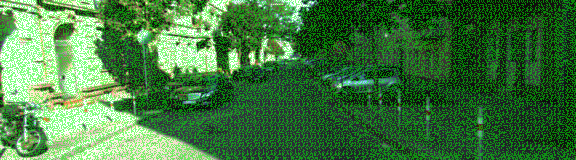
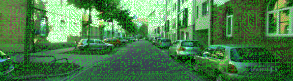
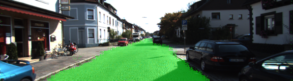
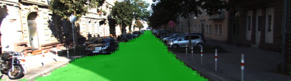

# Semantic Segmentation
### Introduction
In this project, you'll label the pixels of a road in images using a Fully Convolutional Network (FCN).

### Setup
##### Frameworks and Packages
Make sure you have the following is installed:
 - [Python 3](https://www.python.org/)
 - [TensorFlow](https://www.tensorflow.org/)
 - [NumPy](http://www.numpy.org/)
 - [SciPy](https://www.scipy.org/)
##### Dataset
Download the [Kitti Road dataset](http://www.cvlibs.net/datasets/kitti/eval_road.php) from [here](http://www.cvlibs.net/download.php?file=data_road.zip).  Extract the dataset in the `data` folder.  This will create the folder `data_road` with all the training a test images.

### Discussion
#### Initial Difficulties
When building my FCN I ran into some difficulty with tensor shapes, partially because of my silly mistakes and not using the tensors that we took out of vgg for keep_prob and image_input. Then I came to find out I set the number of channels on my `correct_label` tensor to 1 too many. There are only 2 channels on the `correct_label` tensor, because we're doing "road" and "not road". There could be more if there were more classifications. I chose to stick with two for now. Once that was sorted out it was a bit simpler to figure out similar errors. On my very first run, I set my `batch_size` to 10, and left the `correct_label` set to 10 too. Unfortunately when you get through the first run, we end up with only 9 images on the last batch. I figured out that 289 was divisble by 17 and just decided to use a `batch_size` of 17. I know that I could probably use some sort of TF variable here to make this adjustable, but I found that training on a g3.8xlarge goes pretty fast with a batch of 17.
#### Results
##### First Run
With my first run completed my image came out looking like this: 

* Final numbers run 1: `Epoch: 0010 |  cost = 0.725917161`   
This definitely isn't correct, and was actually what I was attempting to avoid by using the `kernel_regularizer` that was suggested in the video. Clearly having the green for road everywhere is not what I want. I noticed that my cost in the very first epoch was _extremely_ high, starting with almost 65!
##### Second Run
I wanted to double check that this isn't working by putting my epochs up to 20 (from the original 10). The starting epoch cost was still very high and you can see the test run image is similar to the first run:  

* Final numbers run 2: `Epoch: 0020 |  cost = 0.701197147`
##### Third Run
Hmm, well this still seems to be a problem, I guess the `kernel_regularizer` isn't helping me as much as I want it to. After taking a look at the forums, I decided to try out the `kernel_initializer` using a truncated normal distribution with a standard deviation of 0.01. This makes sense to me because we have done similar initializations with our other neural networks to positive results. 

* Final numbers run 3: `Epoch: 0010 |  cost = 0.085086457`  
Wow, ok now that is MUCH better. Down to just 0.08 on the cost from a previous 0.70. And this only took 10 epochs.
 
A quick comparison between my first run and the third run:

With kernel_regularizer                                              | With kernel_initializer
:-------------------------------------------------------------------:|:-------------------------------------------------------------------:
 | 
 
I'm much more impressed with the `kernel_initializer` than the `kernel_regularizer` although I have a feeling that I probably messed up my configuratoin for the regularizer somewhere.
